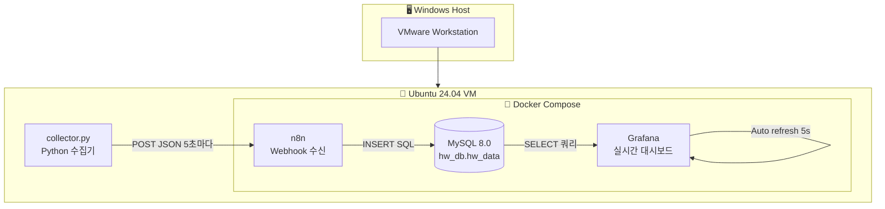

# 컴퓨터 하드웨어 모니터링 시스템
> Docker + n8n + MySQL + Grafana 기반 실시간 하드웨어 모니터링 대시보드

---

## 1. 프로젝트 개요

VMware 위에 Ubuntu 24.04를 구성하고, Docker Compose로 n8n / MySQL / Grafana 컨테이너를 실행하여
Python 수집기가 생성한 하드웨어 시뮬레이션 데이터를 n8n 웹훅으로 수신 → MySQL에 저장 → Grafana로 실시간 시각화하는 시스템.

---

## 2. 개발 환경

| 항목 | 내용 |
|------|------|
| 호스트 OS | Windows 11 |
| 가상화 | VMware Workstation |
| 게스트 OS | Ubuntu 24.04 LTS |
| IDE | VS Code + Remote SSH |
| 컨테이너 | Docker + Docker Compose |
| 워크플로우 | n8n |
| 데이터베이스 | MySQL 8.0 |
| 시각화 | Grafana |
| 수집기 언어 | Python 3.x |

---

## 3. 시스템 아키텍처



---

## 4. 디렉토리 구조

```
n8n-hw-monitor/
├── docker-compose.yml     ← 컨테이너 구성
├── .env                   ← 환경변수 (DB 계정 등)
└── collector.py           ← 하드웨어 데이터 수집 및 전송
```

---

## 5. 주요 파일

### 5-1. docker-compose.yml

```yaml
version: '3.8'

services:
  mysql:
    image: mysql:8.0
    container_name: mysql_db
    restart: always
    environment:
      MYSQL_ROOT_PASSWORD: ${MYSQL_ROOT_PASSWORD}
      MYSQL_DATABASE: ${MYSQL_DATABASE}
      MYSQL_USER: ${MYSQL_USER}
      MYSQL_PASSWORD: ${MYSQL_PASSWORD}
    ports:
      - "3306:3306"
    volumes:
      - mysql_data:/var/lib/mysql
    networks:
      - hw-network

  n8n:
    image: n8nio/n8n
    container_name: n8n
    restart: always
    ports:
      - "5678:5678"
    environment:
      - DB_TYPE=mysqldb
      - DB_MYSQLDB_HOST=mysql
      - DB_MYSQLDB_PORT=3306
      - DB_MYSQLDB_DATABASE=${MYSQL_DATABASE}
      - DB_MYSQLDB_USER=${MYSQL_USER}
      - DB_MYSQLDB_PASSWORD=${MYSQL_PASSWORD}
      - N8N_BASIC_AUTH_ACTIVE=true
      - N8N_BASIC_AUTH_USER=${N8N_USER}
      - N8N_BASIC_AUTH_PASSWORD=${N8N_PASSWORD}
      - N8N_SECURE_COOKIE=false
    volumes:
      - n8n_data:/home/node/.n8n
    depends_on:
      - mysql
    networks:
      - hw-network

  grafana:
    image: grafana/grafana
    container_name: grafana
    restart: always
    ports:
      - "3000:3000"
    environment:
      - GF_SECURITY_ADMIN_USER=admin
      - GF_SECURITY_ADMIN_PASSWORD=admin
    volumes:
      - grafana_data:/var/lib/grafana
    depends_on:
      - mysql
    networks:
      - hw-network

volumes:
  mysql_data:
  n8n_data:
  grafana_data:

networks:
  hw-network:
    driver: bridge
```

### 5-2. .env

```env
MYSQL_ROOT_PASSWORD=rootpassword
MYSQL_DATABASE=hw_db
MYSQL_USER=hw_user
MYSQL_PASSWORD=hwpassword
N8N_USER=admin
N8N_PASSWORD=adminpassword
```

### 5-3. MySQL 테이블 스키마

```sql
CREATE TABLE hw_data (
    id             INT AUTO_INCREMENT PRIMARY KEY,
    timestamp      DATETIME DEFAULT CURRENT_TIMESTAMP,
    cpu_usage      FLOAT,
    cpu_temp       FLOAT,
    cpu_clock      FLOAT,
    gpu_usage      FLOAT,
    gpu_temp       FLOAT,
    gpu_clock      FLOAT,
    ram_used_gb    FLOAT,
    ram_total_gb   FLOAT,
    disk_usage     FLOAT,
    net_latency_ms FLOAT,
    fan_rpm        INT
);
```

### 5-4. collector.py

```python
import psutil
import requests
import time
import random
import math
from ping3 import ping

WEBHOOK_URL = "http://192.168.0.39:5678/webhook/hw-data"

tick = 0

def get_hardware_data():
    global tick
    tick += 1

    # 실제 측정
    cpu_usage = psutil.cpu_percent(interval=1)
    mem = psutil.virtual_memory()
    ram_total_gb = round(mem.total / (1024 ** 3), 2)
    disk_usage = psutil.disk_usage('/').percent

    latency = ping('8.8.8.8', unit='ms')
    net_latency_ms = latency if latency is not None else 0.0

    # 시뮬레이션 (사인파 + 스파이크)
    wave = (math.sin(tick * 0.15) + 1) / 2 * 100
    spike = random.uniform(20, 50) if random.random() < 0.1 else 0
    cpu_sim = cpu_usage * 0.4 + wave * 0.4 + spike + random.uniform(-5, 5)
    cpu_sim = max(5.0, min(100.0, cpu_sim))

    cpu_clock = 3.5 + (cpu_sim / 100) * 1.9 + random.uniform(-0.3, 0.3)
    cpu_temp  = 42.0 + (cpu_sim * 0.45) + random.uniform(-4.0, 4.0)

    gpu_wave  = (math.sin(tick * 0.1 + 1.5) + 1) / 2 * 100
    gpu_spike = random.uniform(30, 60) if random.random() < 0.08 else 0
    gpu_usage = gpu_wave * 0.6 + cpu_sim * 0.3 + gpu_spike + random.uniform(-8, 8)
    gpu_usage = max(0.0, min(100.0, gpu_usage))

    gpu_temp  = 38.0 + (gpu_usage * 0.4) + random.uniform(-3.0, 3.0)
    gpu_clock = 800 + (gpu_usage * 18) + random.uniform(-100, 100)

    max_temp  = max(cpu_temp, gpu_temp)
    fan_rpm   = 1200 + ((max_temp - 40) * 90) + random.uniform(-200, 200)
    fan_rpm   = max(800, min(6500, fan_rpm))

    # RAM 시뮬레이션
    ram_wave    = (math.sin(tick * 0.12 + 2.0) + 1) / 2
    ram_used_gb = round(ram_total_gb * 0.3 + ram_wave * (ram_total_gb * 0.5) + random.uniform(-0.2, 0.2), 2)
    ram_used_gb = max(0.5, min(ram_total_gb, ram_used_gb))

    # 네트워크 레이턴시 스파이크
    latency_spike  = random.uniform(50, 200) if random.random() < 0.12 else 0
    net_latency_ms = net_latency_ms + latency_spike + random.uniform(-5, 5)
    net_latency_ms = max(1.0, net_latency_ms)

    return {
        "cpu_usage":      round(cpu_sim, 2),
        "cpu_temp":       round(cpu_temp, 2),
        "cpu_clock":      round(cpu_clock, 2),
        "gpu_usage":      round(gpu_usage, 2),
        "gpu_temp":       round(gpu_temp, 2),
        "gpu_clock":      round(gpu_clock, 2),
        "ram_used_gb":    round(ram_used_gb, 2),
        "ram_total_gb":   ram_total_gb,
        "disk_usage":     round(disk_usage, 2),
        "net_latency_ms": round(net_latency_ms, 2),
        "fan_rpm":        int(fan_rpm)
    }

def main():
    print("🚀 하드웨어 모니터링 수집기 시작...")
    while True:
        try:
            data = get_hardware_data()
            requests.post(WEBHOOK_URL, json=data)
            print(f"[{time.strftime('%H:%M:%S')}] "
                  f"CPU: {data['cpu_usage']}% {data['cpu_temp']}°C | "
                  f"GPU: {data['gpu_usage']}% {data['gpu_temp']}°C | "
                  f"RAM: {data['ram_used_gb']}GB | "
                  f"Fan: {data['fan_rpm']}RPM | "
                  f"Net: {data['net_latency_ms']}ms")
            time.sleep(5)
        except requests.exceptions.RequestException as e:
            print(f"네트워크 오류: {e}")
            time.sleep(10)
        except KeyboardInterrupt:
            print("\n종료합니다.")
            break

if __name__ == "__main__":
    main()
```

---

## 6. n8n 워크플로우 구성

| 노드 | 설정 |
|------|------|
| Webhook | Method: POST / Path: `hw-data` |
| MySQL | Execute SQL / INSERT INTO hw_data |

### MySQL INSERT 쿼리

```sql
INSERT INTO hw_data
(cpu_usage, cpu_temp, cpu_clock, gpu_usage, gpu_temp, gpu_clock,
 ram_used_gb, ram_total_gb, disk_usage, net_latency_ms, fan_rpm)
VALUES
({{ $json.body.cpu_usage }}, {{ $json.body.cpu_temp }}, {{ $json.body.cpu_clock }},
 {{ $json.body.gpu_usage }}, {{ $json.body.gpu_temp }}, {{ $json.body.gpu_clock }},
 {{ $json.body.ram_used_gb }}, {{ $json.body.ram_total_gb }}, {{ $json.body.disk_usage }},
 {{ $json.body.net_latency_ms }}, {{ $json.body.fan_rpm }});
```

---

## 7. Grafana 대시보드 구성

### 자동 새로고침 설정
- Refresh: `5s`
- 시간 범위: `Last 5 minutes`

### 게이지 바 패널 (6개)

| 패널 | 쿼리 | Unit | Max |
|------|------|------|-----|
| 🌡️ CPU 온도 | `SELECT cpu_temp FROM hw_data ORDER BY timestamp DESC LIMIT 1` | °C | 100 |
| ⚡ CPU 클럭 | `SELECT cpu_clock FROM hw_data ORDER BY timestamp DESC LIMIT 1` | GHz | 6 |
| 🖥️ CPU 사용률 | `SELECT cpu_usage FROM hw_data ORDER BY timestamp DESC LIMIT 1` | % | 100 |
| 🔥 GPU 온도 | `SELECT gpu_temp FROM hw_data ORDER BY timestamp DESC LIMIT 1` | °C | 100 |
| ⚡ GPU 클럭 | `SELECT gpu_clock FROM hw_data ORDER BY timestamp DESC LIMIT 1` | MHz | 3000 |
| 🎮 GPU 사용률 | `SELECT gpu_usage FROM hw_data ORDER BY timestamp DESC LIMIT 1` | % | 100 |

### Time Series 패널

| 패널 | 쿼리 |
|------|------|
| CPU 모니터링 | `SELECT timestamp AS time, cpu_temp, cpu_usage FROM hw_data WHERE timestamp >= NOW() - INTERVAL 5 MINUTE ORDER BY timestamp ASC` |
| GPU 모니터링 | `SELECT timestamp AS time, gpu_temp, gpu_usage FROM hw_data WHERE timestamp >= NOW() - INTERVAL 5 MINUTE ORDER BY timestamp ASC` |
| RAM 사용량 | `SELECT timestamp AS time, ram_used_gb FROM hw_data WHERE timestamp >= NOW() - INTERVAL 5 MINUTE ORDER BY timestamp ASC` |
| 팬 RPM | `SELECT timestamp AS time, fan_rpm FROM hw_data WHERE timestamp >= NOW() - INTERVAL 5 MINUTE ORDER BY timestamp ASC` |
| 네트워크 레이턴시 | `SELECT timestamp AS time, net_latency_ms FROM hw_data WHERE timestamp >= NOW() - INTERVAL 5 MINUTE ORDER BY timestamp ASC` |

---

## 8. 실행 방법

```bash
# 1. 컨테이너 실행
cd n8n-hw-monitor
docker compose up -d

# 2. 상태 확인
docker compose ps

# 3. 데이터 수집기 실행
python3 collector.py
```

### 접속 주소

| 서비스 | 주소 |
|--------|------|
| n8n | http://192.168.0.39:5678 |
| Grafana | http://192.168.0.39:3000 |
| MySQL | 192.168.0.39:3306 |

---

## 9. 수집 데이터 항목

| 항목 | 설명 | 측정 방식 |
|------|------|-----------|
| cpu_usage | CPU 사용률 (%) | 실제 측정 + 시뮬레이션 |
| cpu_temp | CPU 온도 (°C) | 시뮬레이션 |
| cpu_clock | CPU 클럭 (GHz) | 시뮬레이션 |
| gpu_usage | GPU 사용률 (%) | 시뮬레이션 |
| gpu_temp | GPU 온도 (°C) | 시뮬레이션 |
| gpu_clock | GPU 클럭 (MHz) | 시뮬레이션 |
| ram_used_gb | RAM 사용량 (GB) | 실제 측정 + 시뮬레이션 |
| ram_total_gb | RAM 전체 용량 (GB) | 실제 측정 |
| disk_usage | 디스크 사용률 (%) | 실제 측정 |
| net_latency_ms | 네트워크 레이턴시 (ms) | 실제 측정 + 스파이크 |
| fan_rpm | 쿨링팬 RPM | 시뮬레이션 |


## 10. 실행영상
https://github.com/user-attachments/assets/c88b2e48-ca19-4ab7-bcca-af0f8b35e563

